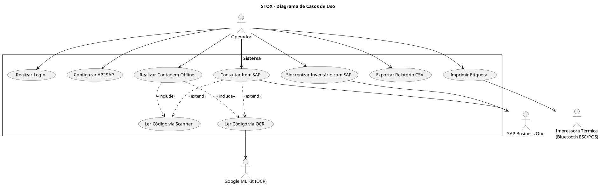

# Casos de Uso — Projeto STOX

## Disciplina
Engenharia de Software

## Projeto
STOX — Plataforma Inteligente de Gestão de Inventário

## Descrição

O STOX é uma plataforma mobile desenvolvida em Flutter para automatizar processos de inventário físico integrados ao SAP Business One via Service Layer API (OData v4/REST).
O sistema permite realizar contagem de estoque em modo offline-first, utilizando leitura de código de barras (mobile_scanner), reconhecimento de texto por câmera via Google ML Kit OCR (google_mlkit_text_recognition) e sincronização posterior com o ERP.

---

# Caso de Uso 01 — Realizar Login

**Ator:** Operador de Inventário

**Objetivo:**
Permitir que o operador acesse o sistema STOX através de autenticação válida no SAP Business One.

## Pré-condições

- Operador possui conta cadastrada no SAP Business One
- URL da Service Layer e CompanyDB configurados no aplicativo
- Conexão com a rede corporativa disponível

## Pós-condições

- SessionID e ROUTEID armazenados localmente
- Nome do operador carregado e exibido no painel principal
- Operador redirecionado para a HomePage

## Fluxo Principal

1. Operador abre o aplicativo STOX.
2. Sistema apresenta a tela de login.
3. Operador informa usuário e senha do SAP.
4. Sistema envia credenciais para o endpoint POST /Login da Service Layer.
5. SAP Business One valida as credenciais e retorna SessionID.
6. Sistema busca o nome do operador via GET /Users e armazena localmente.
7. Operador é redirecionado para o painel principal (HomePage).

## Fluxos Alternativos

### A1 — Credenciais inválidas

1. SAP retorna status diferente de 200.
2. Sistema exibe SnackBar vermelho com mensagem "Credenciais inválidas."
3. Operador retorna ao passo 3 do fluxo principal.

### A2 — API não configurada

1. Sistema detecta ausência de URL ou CompanyDB nas configurações.
2. Sistema exibe mensagem "Configure a API SAP antes de prosseguir."
3. Operador é orientado a acessar a tela de Configuração da API.

### A3 — Falha de conexão

1. Sistema não consegue conectar ao SAP (timeout 15s).
2. Sistema exibe SnackBar vermelho com mensagem de erro de conexão.
3. Operador pode tentar novamente.

### A4 — Uso offline sem login

1. Operador pressiona "MODO CONTADOR OFFLINE" na tela de login.
2. Sistema redireciona para ContadorOfflinePage sem autenticação.
3. Dados coletados ficam armazenados localmente para sincronização posterior.

## Regras de Negócio Relacionadas

RN01 — Somente usuários autenticados no SAP B1 podem acessar funcionalidades de consulta e sincronização.

## Requisitos Relacionados

RF01 — Autenticação via SAP Business One Service Layer
RF09 — Configuração da API

RNF01 — Comunicação exclusiva via HTTPS
RNF02 — Tempo de resposta do login inferior a 15 segundos (timeout configurado)

---

# Caso de Uso 02 — Realizar Contagem Offline

**Ator:** Operador de Inventário

**Objetivo:**
Registrar a quantidade de produtos em estoque utilizando digitação manual, leitura de código de barras ou reconhecimento de texto via OCR, armazenando os dados localmente para sincronização posterior.

## Pré-condições

- Aplicativo instalado no dispositivo Android
- (Opcional) Autenticação SAP para modo conectado

## Pós-condições

- Contagem registrada no banco de dados SQLite local (syncStatus = 0 — Pendente)
- Registro disponível para sincronização com SAP

## Fluxo Principal

1. Operador acessa a tela de Contagem Offline.
2. Operador informa o código do item por um dos três métodos:
   a. Digitação manual no campo "Código do Item"
   b. Leitura de código de barras via scanner (mobile_scanner)
   c. Fotografia da etiqueta com OCR via Google ML Kit
3. Sistema pré-preenche o campo "Depósito" com o valor padrão configurado.
4. Operador ajusta a quantidade (+/- ou digitação direta).
5. Operador pressiona "SALVAR CONTAGEM".
6. Sistema valida campos (código não vazio, depósito não vazio, quantidade > 0).
7. Sistema insere registro no SQLite com syncStatus = 0.
8. Sistema emite feedback: visual (SnackBar verde), sonoro (check.mp3) e tátil (vibração).
9. Campos são limpos e foco retorna ao campo de código para nova leitura.

## Fluxos Alternativos

### A1 — Leitura via OCR

1. Operador pressiona o ícone de IA (auto_awesome).
2. Sistema abre a câmera para captura de foto.
3. Operador fotografa a etiqueta ou anotação com código e quantidade.
4. Sistema abre tela de recorte (ImageCropper) para ajuste da área.
5. Google ML Kit processa a imagem recortada.
6. Sistema extrai código (texto antes do número) e quantidade (último token numérico).
7. Campos são preenchidos automaticamente.

### A2 — Produto não identificado pelo OCR

1. OCR não consegue extrair texto válido da imagem.
2. Campos permanecem em branco.
3. Operador preenche manualmente.

### A3 — Validação falha

1. Sistema detecta campo obrigatório vazio ou quantidade inválida.
2. Sistema emite feedback: SnackBar laranja/vermelho e vibração de erro.
3. Operador corrige e tenta novamente.

### A4 — Edição de contagem existente

1. Operador pressiona o ícone de edição em um registro do histórico.
2. Sistema exibe diálogo com ajuste de quantidade (+/-).
3. Sistema atualiza registro e redefine syncStatus = 0 (Pendente).

### A5 — Exclusão de contagem

1. Operador pressiona longa na linha do histórico.
2. Sistema exibe diálogo de confirmação.
3. Operador confirma exclusão.
4. Sistema remove registro do SQLite.

## Regras de Negócio Relacionadas

RN02 — Nenhuma contagem pode ser salva sem código de item, depósito e quantidade válida (> 0).
RN05 — Ao editar uma contagem, syncStatus retorna para Pendente (0).

## Requisitos Relacionados

RF02 — Modo Contador Offline
RF03 — Leitura de Código de Barras
RF04 — Leitura via OCR com IA

RNF03 — Funcionalidades de contagem disponíveis sem conexão com a internet
RNF04 — Processamento de OCR local inferior a 3 segundos
RNF05 — Registro de contagem em no máximo 3 interações

---

# Caso de Uso 03 — Sincronizar Inventário com SAP

**Ator:** Operador de Inventário / SAP Business One

**Objetivo:**
Enviar as contagens registradas localmente ao SAP Business One, atualizando o inventário oficial no ERP.

## Pré-condições

- Operador autenticado no SAP Business One
- Existência de contagens com syncStatus = 0 (Pendente) ou 2 (Erro)
- Conexão com a SAP Service Layer ativa

## Pós-condições

- Contagens enviadas com sucesso removidas do banco local
- Inventário atualizado no SAP Business One
- Operador notificado do resultado

## Fluxo Principal

1. Operador acessa o painel principal (HomePage).
2. Sistema exibe contagens pendentes e o botão "SINCRONIZAR AGORA".
3. Operador pressiona o botão de sincronização.
4. Sistema monta payload com todas as contagens pendentes, incluindo ItemCode, WarehouseCode e CountedQuantity.
5. Sistema envia POST para o endpoint /InventoryCountings da Service Layer.
6. SAP processa e retorna status 200 ou 201.
7. Sistema remove contagens sincronizadas do banco local.
8. Sistema exibe SnackBar verde e emite feedback sonoro (check.mp3) e tátil.

## Fluxos Alternativos

### A1 — Item duplicado no SAP (erro -1310)

1. SAP retorna erro com código -1310 ou mensagem "already".
2. Sistema exibe diálogo explicativo identificando o item com contagem aberta.
3. Operador é orientado a finalizar a contagem aberta no SAP antes de reenviar.

### A2 — Sessão expirada (401)

1. SAP retorna status 401.
2. Sistema realiza logout automático e redireciona para tela de login.

### A3 — Falha de comunicação

1. Sistema não consegue conectar ao SAP (timeout 30s).
2. Contagens permanecem no banco com syncStatus = 2 (Erro).
3. Sistema exibe SnackBar vermelho com mensagem de falha.
4. Operador pode tentar novamente quando a conexão for restabelecida.

## Regras de Negócio Relacionadas

RN01 — Somente usuários autenticados podem sincronizar.
RN03 — Em caso de falha, o registro recebe syncStatus = 2 e permanece disponível para reprocessamento.

## Requisitos Relacionados

RF06 — Sincronização com SAP via POST /InventoryCountings

RNF01 — Comunicação via HTTPS
RNF02 — Envio de contagem com timeout de 30 segundos

---

# Caso de Uso 04 — Consultar Item SAP

**Ator:** Operador de Inventário

**Objetivo:**
Consultar informações detalhadas de um item no SAP Business One, incluindo estoque por depósito, unidade de medida e status.

## Pré-condições

- Operador autenticado no SAP Business One
- Conexão com a SAP Service Layer ativa

## Pós-condições

- Informações do item exibidas na tela (código, nome, UOM, status, estoque por depósito)
- Opção de imprimir etiqueta disponível para cada depósito com estoque

## Fluxo Principal

1. Operador acessa a tela "Consultar Item".
2. Operador informa código ou nome do item (digitação, scanner ou OCR).
3. Sistema envia GET para /Items com filtro por código ou nome (debounce 600ms).
4. Se resultado único: sistema carrega detalhes automaticamente.
5. Se múltiplos resultados: sistema exibe lista para seleção.
6. Sistema exibe: código, nome, UOM, flags de estoque/venda/compra, status de bloqueio e estoque por depósito.
7. Operador pode pressionar o ícone de impressão em qualquer depósito para gerar etiqueta.

## Requisitos Relacionados

RF05 — Consulta de Item via GET /Items
RF08 — Impressão de Etiqueta via Bluetooth

---

# Relação Caso de Uso → User Stories → MVP

Caso de Uso relacionado: **Contagem de Estoque (fluxo completo)**

## User Stories do MVP (Implementadas)

US01
Como operador de inventário,
quero fazer login com meu usuário e senha do SAP,
para acessar o sistema com segurança.

US02
Como operador,
quero configurar a URL da Service Layer e o CompanyDB,
para que o aplicativo se conecte ao ambiente correto do SAP.

US03
Como operador,
quero escanear o código de barras de um produto,
para identificar o item rapidamente sem digitar.

US04
Como operador,
quero fotografar uma etiqueta ou anotação,
para que o sistema leia o código e a quantidade automaticamente via OCR.

US05
Como operador,
quero confirmar ou ajustar a quantidade contada,
para garantir a precisão dos dados antes de salvar.

US06
Como operador,
quero sincronizar as contagens com o SAP,
para atualizar o inventário oficial no ERP.

US07
Como operador,
quero consultar um item no SAP,
para verificar o estoque atual por depósito antes de contar.

US08
Como operador,
quero exportar um relatório CSV das contagens,
para compartilhar ou arquivar os dados do inventário.

US09
Como operador,
quero imprimir uma etiqueta com código de barras via Bluetooth,
para identificar fisicamente os itens no depósito.

## User Stories Pós-MVP (Planejadas)

US10 — Relatórios avançados com filtro por período e operador
US11 — Detecção e sinalização de divergências entre contagem e estoque SAP
US12 — Dashboard gerencial com indicadores de inventário
US13 — Histórico de inventários entre sessões
US14 — Sugestão automática de reposição de itens críticos

---

# Diagrama de Casos de Uso (PlantUML)

